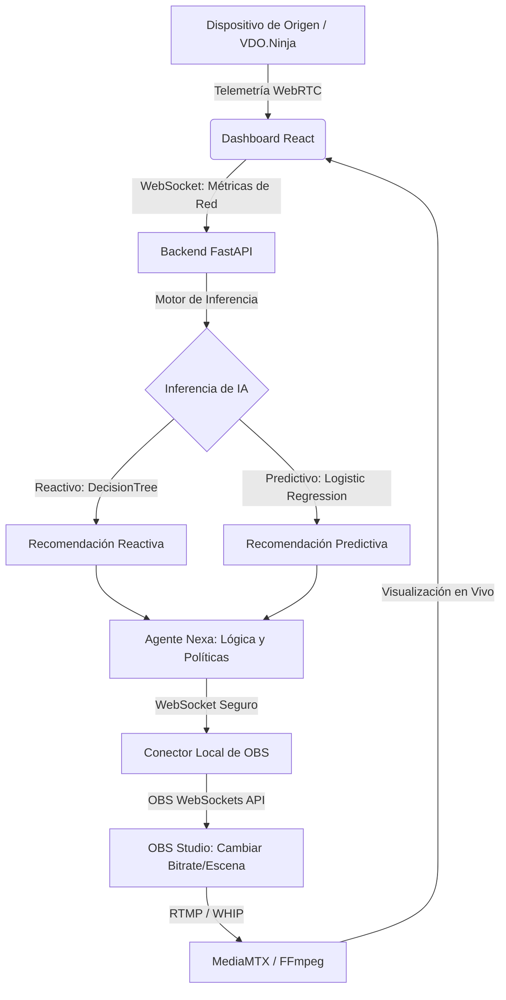

# StreamML

**Streaming Adaptativo Inteligente y Predicción de Reducción de Calidad mediante Machine Learning**

**Integrantes:** Alexis Guaman y Cinthya Ramon.  
**Materia:** Inteligencia Artificial

---

## 1. ¿Qué es StreamML?

**StreamML** es un prototipo reproducible y de nivel de producción de **streaming adaptativo inteligente**. Su objetivo principal es optimizar la calidad de las transmisiones de video en vivo (bitrate y resolución) en tiempo real, adaptándose dinámicamente a las condiciones cambiantes y fluctuaciones de la red de internet del streamer.

A diferencia de los sistemas tradicionales de streaming que dependen únicamente de reglas estáticas, StreamML utiliza un **enfoque híbrido de Inteligencia Artificial**:
* **Reactivo**: Evalúa el estado de red segundo a segundo para tomar decisiones inmediatas ante caídas súbitas.
* **Predictivo**: Analiza ventanas de 10 minutos de datos históricos para anticiparse a la degradación de la señal antes de que afecte la transmisión.

El sistema completo automatiza el control de **OBS Studio**, conmuta a escenas de respaldo ante cortes totales del servicio y reestablece la transmisión normal una vez que la red vuelve a ser estable, garantizando la mejor Calidad de Experiencia (QoE) para el espectador.

---

## 2. El Proceso de Desarrollo: Dos Fases Clave

El proyecto fue desarrollado bajo una metodología rigurosa dividida en dos etapas complementarias:

### Fase 1: Entrenamiento y Experimentación de IA (El "Cerebro")
Antes de programar la infraestructura de software, se realizó una fase experimental de ciencia de datos utilizando cuadernos de Jupyter. En esta etapa se recolectaron datasets reales de telemetría de red y se entrenaron los modelos supervisados que actúan como el núcleo inteligente ("cerebro") de StreamML:

* **Modelo Reactivo (`DecisionTreeClassifier`)**:
  * **Misión**: Clasificar la calidad óptima instantánea del canal en tres perfiles: `low`, `medium` o `high`.
  * **Variables**: `upload_mbps` (subida), `download_mbps` (descarga) y `latency_ms` (latencia).
  * **Desempeño**: **99.91% Macro F1** en el conjunto de pruebas. Responde en milisegundos.
* **Modelo Predictivo (`LogisticRegression`)**:
  * **Misión**: Clasificar una ventana temporal para predecir si en los próximos 10 minutos la calidad se mantendrá (`maintain`) o si se requerirá una reducción preventiva (`downgrade_needed`).
  * **Variables**: 19 estadísticas de tendencia calculadas sobre **600 segundos históricos** (pendientes, percentiles de latencia, desviación del throughput).
  * **Desempeño**: **100.00% Macro F1** en pruebas (gracias a clases bien marcadas en los datos de entrenamiento).

### Fase 2: Arquitectura de Microservicios e Infraestructura (El "Cuerpo")
Una vez entrenados y exportados los modelos (como archivos `.joblib` en `models/registry/`), se construyó la infraestructura de software distribuida para ejecutar el sistema de forma continua, segura y escalable:

* **Backend y Motor de Inferencia (FastAPI)**: Orquesta la lógica del negocio, recibe la telemetría a través de WebSockets de alta velocidad y ejecuta las predicciones con el motor de inferencia.
* **Interfaz de Usuario (React + TypeScript)**: Panel web interactivo que monitorea en tiempo real las métricas de red, las recomendaciones de los modelos de IA y el estado de la transmisión.
* **Conector Local de OBS (Python)**: Un puente ligero que se ejecuta localmente junto a OBS Studio, recibiendo de forma segura las directrices del backend para cambiar perfiles y escenas de forma instantánea.
* **Servidor de Medios (MediaMTX + FFmpeg)**: Gestiona los flujos de video y permite la inyección de señales de respaldo (videos locales de problemas técnicos) si el streamer pierde conexión total.
* **Proxy Inverso (Nginx)**: Asegura la comunicación TLS/SSL de extremo a extremo, enrutando de manera centralizada la API, el dashboard web y la señal WebRTC/HLS.
* **Contenedores (Docker & Docker Compose)**: Toda la arquitectura del servidor está aislada y se despliega con un solo comando para máxima portabilidad y consistencia.

---

## 3. Flujo de Funcionamiento del Sistema

El flujo operativo sigue un ciclo de retroalimentación continuo orientado a eventos:



### Paso a Paso del Flujo:
1. **Captura de Métricas**: El origen de video (vía VDO.Ninja) envía telemetría de red en tiempo real (pérdida de paquetes, latencia, jitter, ancho de banda) al frontend.
2. **Envío de Telemetría**: El frontend transmite estas métricas al Backend a través de un WebSocket persistente.
3. **Inferencia Inteligente**:
   * El **Modelo Reactivo** analiza la muestra actual en milisegundos.
   * El **Modelo Predictivo** evalúa la ventana histórica de los últimos 10 minutos para estimar la tendencia de degradación.
4. **Filtro del Agente**: El Agente Nexa recibe ambas recomendaciones y aplica políticas operativas de control (como tiempos de espera o cooldowns) para evitar cambios bruscos y repetitivos de calidad.
5. **Ejecución del Cambio**: Si se aprueba una acción, el Backend envía un comando firmado al **Conector Local de OBS**, que realiza el ajuste de bitrate en OBS Studio o cambia la escena a "Respaldo".
6. **Monitoreo**: El panel de control de React actualiza los logs de auditoría y muestra el estado emocional del agente y el estado de transmisión actualizados.

---

## 4. El Agente Nexa: Identidad y Políticas de Control

**Nexa** es el agente determinista encargado de tomar la decisión final a partir de lo que sugieren los modelos de IA. Su rol es crítico porque actúa como una capa de seguridad operativa:

* **Políticas de Cooldown e Histéresis**: Impide que la calidad cambie de `high` a `low` e inmediatamente de vuelta a `high` de forma constante (efecto "flapping") debido a picos pasajeros de red.
* **Gestión de Respaldos**: Si el flujo de telemetría o de video se interrumpe por completo, Nexa ordena a OBS cambiar a la escena de respaldo y solicita a FFmpeg inyectar un video en bucle para que el streaming no se caiga. Una vez estabilizada la red por un periodo prudencial, restablece el vivo.
* **Estados Visuales Emocionales**: Nexa se visualiza en el frontend con cinco posturas dinámicas que informan intuitivamente al usuario del estado operativo:
  1. 💻 **Neutral**: Observando la red, transmisión estable.
  2. 🤔 **Pensando**: Ejecutando inferencias en el modelo predictivo.
  3. ⚡ **Trabajando**: Enviando directivas y aplicando cambios de bitrate.
  4. ✅ **Éxito**: Ajuste aplicado exitosamente y red estabilizada.
  5. ❌ **Error**: Fallo en la comunicación, pérdida de paquetes crítica o desconexión.

---

## 5. Guías y Documentación de Referencia

Para una inmersión detallada en aspectos específicos del proyecto, consulte los siguientes documentos:

> [!NOTE]
> * **Levantamiento del Proyecto**: Consulta la [Guía Paso a Paso para Levantar el Proyecto](.../StreamML/docs/paso-a-paso-levantar-proyecto.md) para ejecutarlo en desarrollo local y producción.
> * **Diseño de Software**: Consulta la guía de [Arquitectura y Estructura del Proyecto](.../StreamML/docs/arquitectura-y-estructura.md) para ver la explicación del árbol de carpetas y los módulos de código.
> * **Decisiones Técnicas**: Consulta la justificación de seguridad, ML e infraestructura en [Decisiones Técnicas de StreamML](f.../StreamML/docs/decisiones-tecnicas.md).
> * **Interfaz del Conector**: Revisa la guía de operación en [Configuración de la GUI del Conector](.../StreamML/docs/configuracion-gui.md).

---

## 6. Guía de Despliegue en Producción

El repositorio ha sido optimizado para servidores de producción, aislando las dependencias pesadas de experimentación.

### Requisitos Previos
* Docker y Docker Compose instalados.
* Dominio público y certificados SSL configurados (necesarios para evitar que los navegadores bloqueen WebRTC).
* Python instalado en la máquina local de transmisión (para ejecutar el Conector de OBS).

> [!IMPORTANT]
> **Separación de roles:** Los microservicios de backend, base de datos, media server y proxy se ejecutan centralizados en el servidor con **Docker**. Sin embargo, el **Conector Local de OBS** (`apps/connector`) debe ejecutarse en el computador local del streamer para interactuar con su OBS Studio local.

### Proceso de Configuración e Instalación

1. **Ejecutar el Asistente de Configuración:**
   En Windows:
   ```powershell
   .\setup.ps1
   ```
   En Linux/macOS:
   ```bash
   bash setup.sh
   ```

2. **Ingresar Parámetros:**
   El asistente interactivo solicitará el dominio, credenciales del administrador y rutas a los certificados SSL (`fullchain.pem` y `privkey.pem`). Generará el archivo `.env` de manera automática.

3. **Levantar los Servicios:**
   Una vez configurado el archivo `.env`, compile y levante los contenedores en segundo plano:
   ```bash
   docker-compose -f infrastructure/docker/docker-compose.yml up -d
   ```

---

## 7. Operación y Mantenimiento

### Panel de Control
Acceda al dominio configurado a través del puerto 443 (HTTPS). Inicie sesión con sus credenciales. El panel le proveerá las credenciales RTMP/WHEP para vincular OBS Studio o cámaras externas.

### Consideraciones sobre WebRTC y HLS
Si se levanta el proyecto sin SSL (HTTP o en `localhost`), las políticas de seguridad de los navegadores modernos bloquearán WebRTC. En este caso, el reproductor de StreamML hará un downgrade automático a HLS. Esto mantiene la transmisión activa, pero añade aproximadamente 10 segundos de latencia.

### Periodo de Inicialización (Cold Start)
El modelo predictivo requiere exactamente 600 segundos (10 minutos) ininterrumpidos de telemetría. Durante este tiempo de inicio, las decisiones operarán exclusivamente basadas en el modelo reactivo.

### Respaldo y Restauración
Toda la base de datos (SQLite), usuarios y configuración se almacena en el volumen local `deployment/`. Para realizar un respaldo, detenga los servicios con `docker-compose down` y copie dicho directorio.

---

## 8. Conclusiones

El proyecto StreamML demuestra con éxito cómo combinar modelos predictivos y reactivos de Machine Learning con reglas deterministas para resolver el problema del streaming adaptativo:

1. **Eficacia del Entrenamiento de Modelos**: La etapa inicial de experimentación demostró que modelos clásicos supervisados (como `DecisionTreeClassifier` para respuestas reactivas inmediatas y `LogisticRegression` para tendencias predictivas preventivas) alcanzan una excelente precisión (superior al 99% Macro F1) con un consumo de recursos computacionales mínimo, lo que permite su despliegue en entornos embebidos o servidores ligeros.
2. **Seguridad y Control del Agente**: La implementación del agente determinista Nexa es fundamental. Los modelos de IA proveen recomendaciones analíticas, pero es la lógica del agente (con cooldowns, márgenes de seguridad y gestión de escenas de respaldo) la que dota al sistema de robustez, previniendo fluctuaciones erráticas y protegiendo la experiencia del espectador ante pérdidas totales de señal.
3. **Consistencia de la Arquitectura de Microservicios**: La separación de responsabilidades y la contenedorización con **Docker** aseguran un entorno homogéneo e independiente de la plataforma del servidor. Esto facilita desplegar y escalar módulos como el servidor de medios (MediaMTX), el backend orquestador (FastAPI) y el proxy inverso (Nginx) de manera independiente.
4. **Transparencia y Operación**: La combinación de un dashboard visual reactivo en tiempo real con logs de auditoría estructurados proporciona a los administradores una observabilidad total de las decisiones automatizadas de la IA, sin comprometer datos confidenciales, alineándose con las mejores prácticas de ciberseguridad.

---

## 9. Referencias

* *Brownlee, J. (2020)*. Machine Learning Mastery with Python. Machine Learning Mastery.
* *Chollet, F. (2017)*. Deep Learning with Python. Manning Publications.
* *Scikit-learn developers. (2023)*. scikit-learn: Machine Learning in Python. Recuperado de https://scikit-learn.org/
* *FastAPI community. (2023)*. FastAPI: High performance web framework. Recuperado de https://fastapi.tiangolo.com/
* *MediaMTX. (2023)*. MediaMTX: Ready-to-use SRT / WebRTC / RTSP / RTMP / LL-HLS media server. Recuperado de https://github.com/bluenviron/mediamtx
* *React community. (2023)*. React: The library for web and native user interfaces. Recuperado de https://react.dev/
